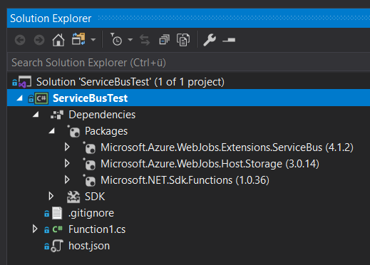
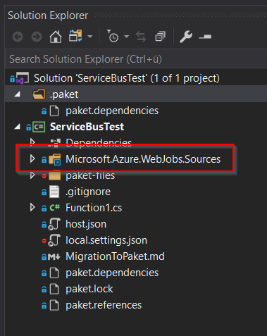

# Azure Function with ServiceBusTrigger and Paket
This repository demonstrates the different behaviour of a dotnet solution
implementing an Azure Function using Nuget and Paket for package-management.

## Package Microsoft.Azure.WebJobs.Extensions.ServiceBus 4.1.2
Using ServiceBus-Bindings requires adding the Package
[Microsoft.Azure.WebJobs.Extensions.ServiceBus](https://www.nuget.org/packages/Microsoft.Azure.WebJobs.Extensions.ServiceBus/)
to the project. Version 4.1.2 (current at time of writing this) has a dependency to
[Microsoft.Azure.WebJobs.Sources](https://www.nuget.org/packages/Microsoft.Azure.WebJobs.Sources/)
that adds 10 C# source code files as content-files to the referencing solution.

```xml
<contentFiles>
    <files include="cs/netstandard2.0/Microsoft.Azure.WebJobs.Sources/Converters/AsyncConverter.cs" buildAction="Compile" />
    <files include="cs/netstandard2.0/Microsoft.Azure.WebJobs.Sources/Converters/CompositeObjectToTypeConverter.cs" buildAction="Compile" />
    <files include="cs/netstandard2.0/Microsoft.Azure.WebJobs.Sources/Converters/ConversionResult.cs" buildAction="Compile" />
    <files include="cs/netstandard2.0/Microsoft.Azure.WebJobs.Sources/Converters/IAsyncObjectToTypeConverter.cs" buildAction="Compile" />
    <files include="cs/netstandard2.0/Microsoft.Azure.WebJobs.Sources/Converters/IdentityConverter.cs" buildAction="Compile" />
    <files include="cs/netstandard2.0/Microsoft.Azure.WebJobs.Sources/Converters/IObjectToTypeConverter.cs" buildAction="Compile" />
    <files include="cs/netstandard2.0/Microsoft.Azure.WebJobs.Sources/Triggers/ITriggerDataArgumentBinding.cs" buildAction="Compile" />
    <files include="cs/netstandard2.0/Microsoft.Azure.WebJobs.Sources/TypeUtility.cs" buildAction="Compile" />
    <files include="cs/netstandard2.0/Microsoft.Azure.WebJobs.Sources/DictionaryExtensions.cs" buildAction="Compile" />
    <files include="cs/netstandard2.0/Microsoft.Azure.WebJobs.Sources/Sanitizer.cs" buildAction="Compile" />
</contentFiles>
```

## Behaviour with Nuget
Branch: [nuget-version](https://github.com/thomas-mutter/azure-servicebus-test/tree/nuget-version)

When adding Extensions.ServiceBus to the project in VS 2019 using "Manage Nuget Packages..." by default, Contentfiles from
indirectly referenced packages where not added to the project.



## Behaviour with Paket
Branch: [paket-version](https://github.com/thomas-mutter/azure-servicebus-test/tree/paket-version)

When the project is migrated to paket using the proposed method in the [documentation](MigrationToPaket.md), the reference
to Microsoft.Azure.WebJobs.Sources is added as direct dependency in VS and Content-Files are added to the project.



## Issue with Stylecop
Normally this is not a problem. But if using Stylecop with a specific set of rules which don't actually match rules
applied in the code coming from the Webjobs-Package results in style errors when compiling this project.
Having Stylecop applied in a project usually meens also to have something like

```xml
<PropertyGroup>
    <TreatWarningsAsErrors>true</TreatWarningsAsErrors>
    <WarningsAsErrors />
</PropertyGroup>
```

in the actual project, that makes that the build fails if any style-warnings exists.
